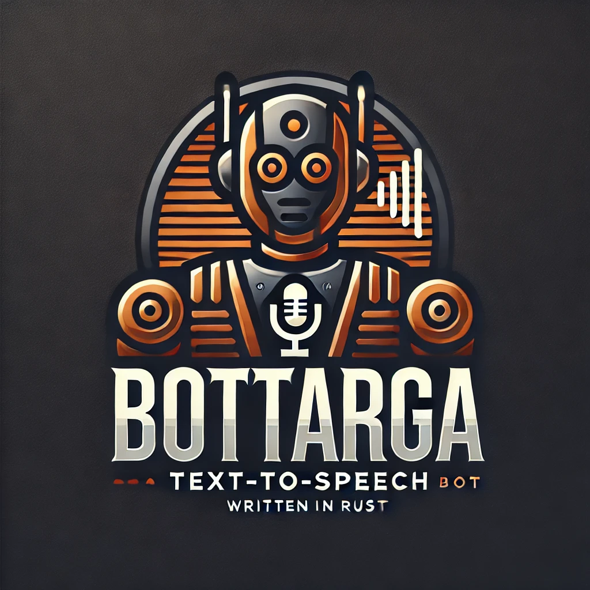

<div style="text-align:center"></div>

# Bottarga

Bottarga is a simle Text to Speech bot for Twitch chat.
It can read chat messages and convert them to the voice.
Can interact with Twitch Chat. And execute commands from chat.
Command are predefined and can be extended.

---

## Table of Contents

1. [Overview](#overview)
2. [Capabilities](#capabilities)
3. [Installation](#installation)
4. [Documentation](#documentation)
5. [Contributing](#contributing)
6. [License](#license)

---

## Overview

Bottarga is a multi-functional project that integrates various components to provide a robust framework for managing tasks, processing audio, handling bot commands, and interacting with external services like Twitch. It leverages asynchronous programming with [Tokio](https:#tokio.rs/) to ensure high performance and scalability.

---

## Capabilities

### 1. **Task Management**

- Add and manage asynchronous tasks.
- Execute tasks with retry mechanisms.
- List and monitor running tasks.

### 2. **Audio Playback**

- Play, stop, and manage audio streams.
- Notify and handle audio playback events.

### 3. **Twitch Client**

- Interact with Twitch APIs and services for streaming and chat integration.

### 4. **IRC Parsing**

- Parse and process IRC messages for real-time communication.

### 5. **Text-to-Speech (TTS)**

- Generate and play TTS audio streams.

### 6. **Bot Commands**

- Process and execute bot commands for automation.
- Available commands:
  - **`!help`**: Show help message and list all commands.
  - **`!list_locales`**: Show list of supported locales for TTS.
  - **`!reset_voice`**:
    > Reset voice to random if no arguments are provided.  
    > If arguments are provided, a text search is applied on VoiceDB to find a voice.  
    > In case of multiple results, a random one is selected from the search results.
  - **`!stop`**: Stop Audio playing.

### 7. **External Bot Commands**

- Process and execute external bot commands for automation, loaded from external config file.

---

## Installation

To set up Bottarga, follow these steps:

1. Clone the repository:
   ```bash
   git clone https:#github.com/icsboyx/bottarga.git
   ```
2. Navigate to the project directory:
   ```bash
   cd bottarga
   ```
3. Run the application using Cargo:

   ```bash
   cargo run --release
   ```

4. Build the project using Cargo:
   ```bash
   cargo build --release
   ```

---

## Documentation

This is the link to the documentation [Documentation](docs/README.md)

## Contributing

We welcome contributions to Bottarga!

## License

This project is licensed under the MIT License. See the [LICENSE](LICENSE) file for more information.

## Additional Resources

- [Rust Documentation](https:#doc.rust-lang.org/)
- [Tokio Documentation](https:#tokio.rs/)
- [GitHub Repository](https:#github.com/icsboyx/bottarga)
