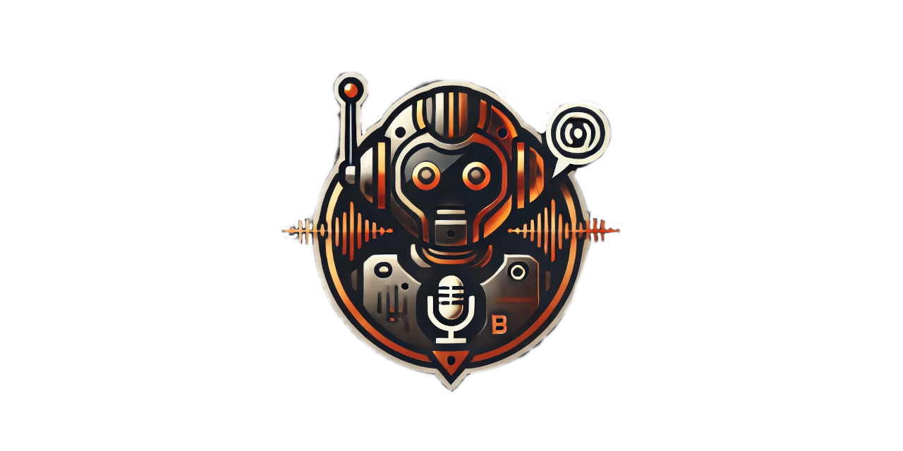

# Bottarga

<p align="center">
  
</p>

Bottarga is a Twitch chat text-to-speech bot written in Rust.

It connects to Twitch through EventSub WebSocket, receives chat messages, converts them to speech, plays the generated audio locally, and handles chat commands. Replies are sent through the Twitch Helix chat API.

## Features

- Twitch EventSub WebSocket chat listener
- Twitch OAuth token bootstrap and validation
- Chat replies through Helix `chat/messages`
- Text-to-speech with `msedge-tts`
- Per-user voice selection persisted in `.config/UsersDB.toml`
- Built-in bot commands
- Configurable external commands with optional audio clips
- Audio playback with Kira and optional Linux PulseAudio sink support
- Tokio task manager with restart support

## How It Works

```text
Twitch EventSub WebSocket
        |
        v
TwitchChatMessage
        |
        +--> TTS queue --> speech synthesis --> audio queue --> audio player
        |
        +--> command broadcast --> bot commands --> Helix chat reply
```

## Requirements

- Rust stable toolchain
- A Twitch account for the bot/user token
- Network access to Twitch APIs and EventSub
- Audio output on the host machine
- On Linux, optional PulseAudio sink configuration for routed playback

## Setup

Clone and build the project:

```bash
git clone https://github.com/icsboyx/bottarga.git
cd bottarga
cargo build --release
```

Run the bot:

```bash
cargo run --release
```

On first run, Bottarga prompts for:

- a Twitch OAuth redirect URL after authorization
- the Twitch channel name to join

The generated runtime configuration is stored under `.config/`.

## Twitch Scopes

Bottarga requests the scopes configured in `.config/TwitchScopesConfig.toml`. Like the other runtime configuration files, this file is generated automatically when missing. It is mentioned separately because changing it changes the OAuth permissions requested from Twitch.

The token is validated on startup. If the stored token is missing, invalid, or does not contain all configured scopes, the bot prints a Twitch authorization URL and asks for the redirected URL.

## Configuration

Bottarga generates runtime configuration files under `.config` when they are missing.

Current configuration files:

- `.config/TwitchToken.toml`: OAuth access token and validated token identity.
- `.config/TwitchScopesConfig.toml`: OAuth scopes requested during Twitch authorization.
- `.config/StreamerChannel.toml`: Twitch channel login and broadcaster user id.
- `.config/UsersDB.toml`: per-user TTS voice preferences.
- `.config/UserDefaultVoiceConfig.toml`: default voice search filter for new users.
- `.config/VoiceDB.toml`: generated voice catalog for inspection.
- `.config/AudioControl.toml`: audio playback settings.
- `.config/ExternalBotCommands.toml`: custom chat commands.

## Commands

Built-in commands use the `!` prefix:

- `!help`: list registered commands.
- `!list_locales`: list available TTS locales.
- `!reset_voice <filter>`: choose a random voice matching the filter terms for the sender.
- `!stop`: stop current audio playback.

External commands are loaded from `.config/ExternalBotCommands.toml` and can define aliases, required arguments, reply text, and optional audio URLs.

## Documentation

- [User guide](docs/user_guide.md): setup, configuration, commands, and troubleshooting.
- [Technical documentation](docs/technical.md): module and runtime details.

## License

This project is licensed under the terms in [LICENSE](LICENSE).
